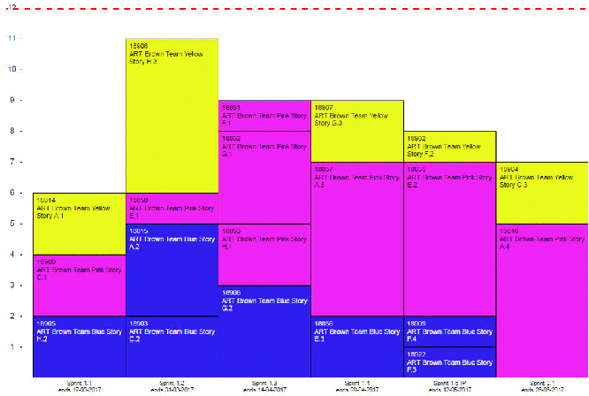

# Timebox Planning Widget - a Rational Team Concert (RTC) extension for Timebox based Planning with SAFe support

## Information and latest News
- [Blog on wordpress.com](https://timeboxplanning.wordpress.com/)
- [YouTube Channel](https://www.youtube.com/channel/UCcvclkdfdmOS6AuR62bZ_PA/playlists)
- [Presentation on slideshare.net](https://www.slideshare.net/MarkusGiacomuzzi)

## Idea and goal
This project delivers a new widget for RTC (Rational Team Concert) to allow iteration/sprint planning of work items in a *Tetris-Like* way. This was also the inspiriation for calling it **_Timebox Planning_**.

The widget is available as a serverside plugin, which can be installed on any RTC (CCM) instance.

## Compatibility
The Widget works for CLM V.4.0.3 and later. Currently it is in successful operation on V.6.0.3.
Since it is implemented process independently it supports the brand new SAFe template as well as any others including your customizations

## Releases
Today we offer you a binary distribution, which can be downloaded from this project and installed on your system. The current stable release can be downloaded directly from the [Releases](https://github.com/jazz-community/rtc-timeboxplanning/releases) page.

## Contributing
Please use the [Issue Tracker](https://github.com/jazz-community/rtc-timeboxplanning/issues) of this repository to report issues or suggest enhancements.
Please refer to our [Contributing Guide](CONTRIBUTING.md#contributing) if you would like to help us improving this software.

## Licensing
Copyright (c) Siemens AG. All rights reserved. 
Licensed under the [MIT](LICENSE.md) License.

